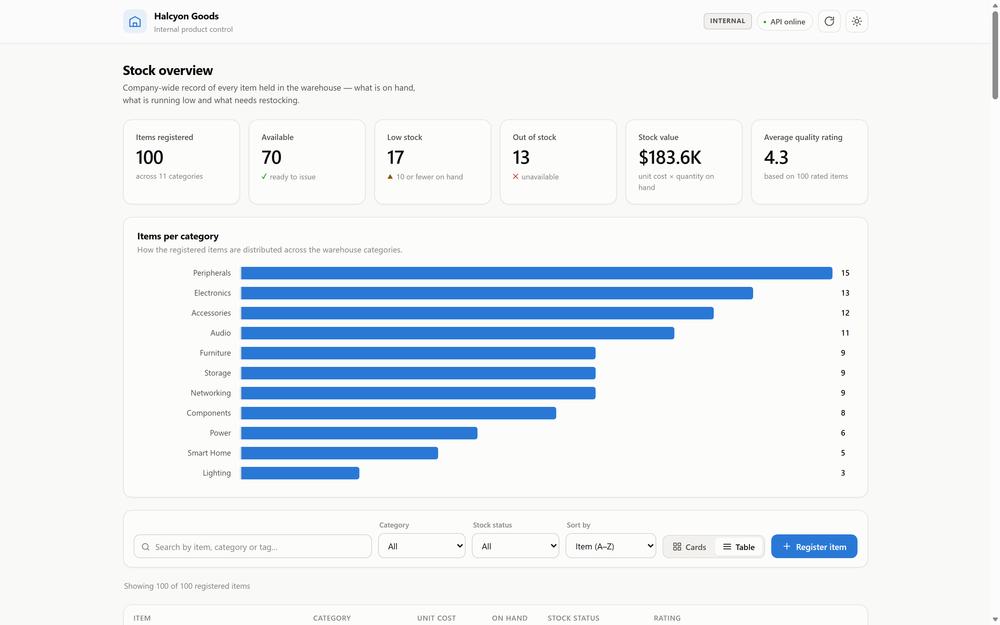
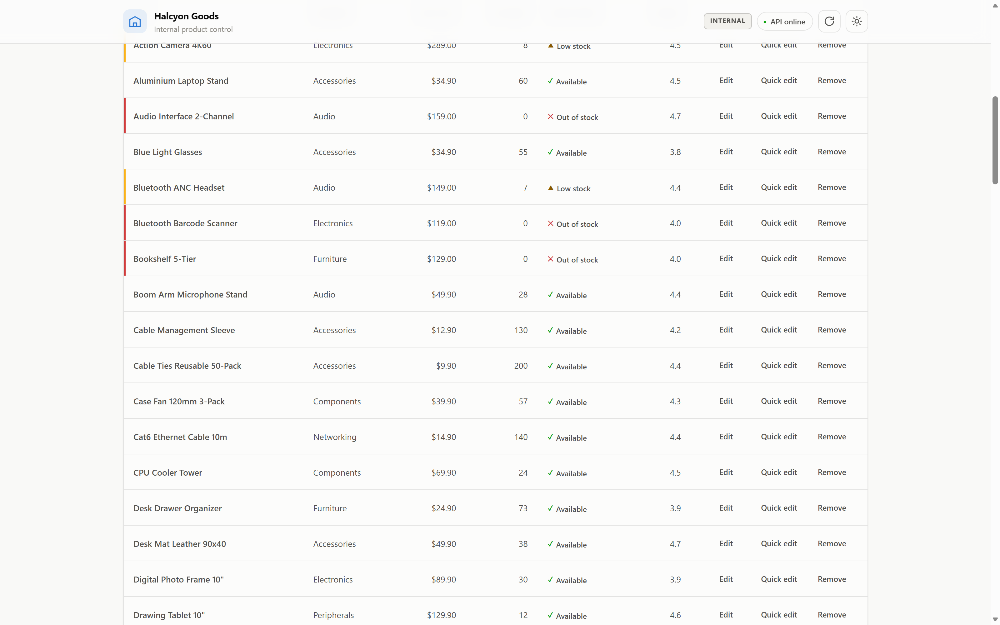
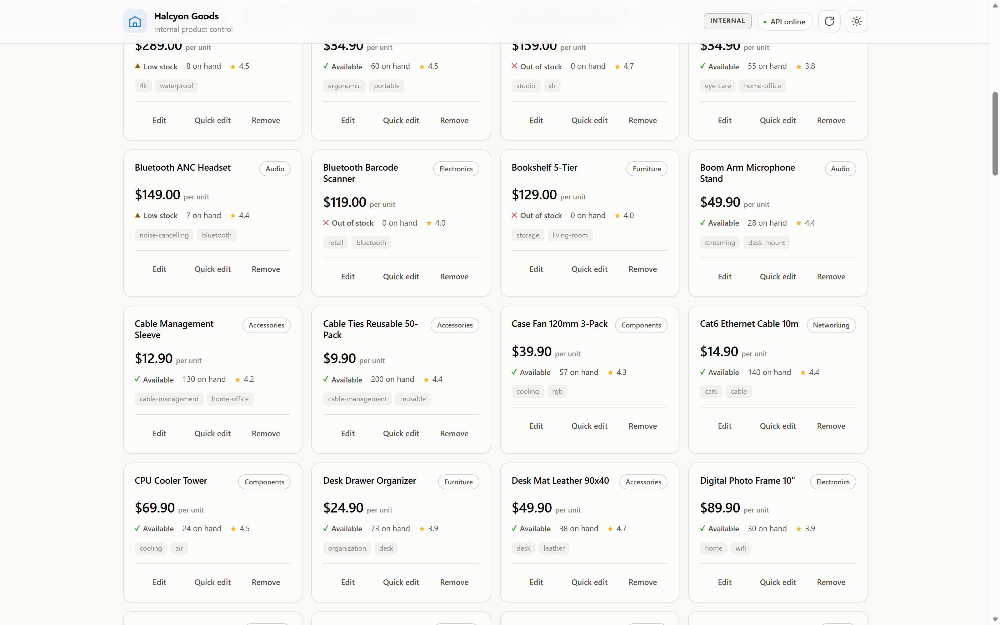
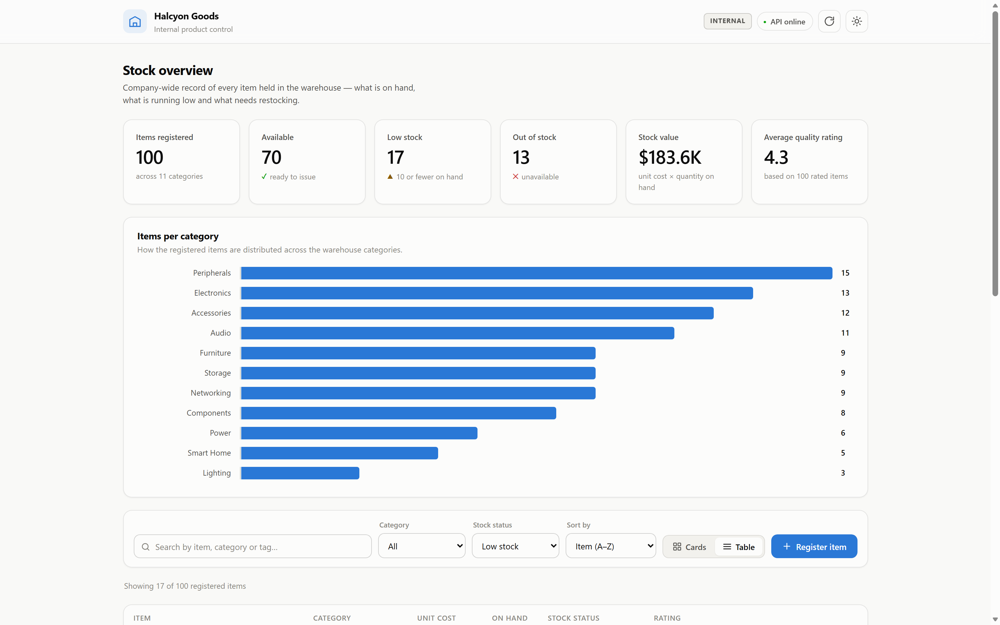
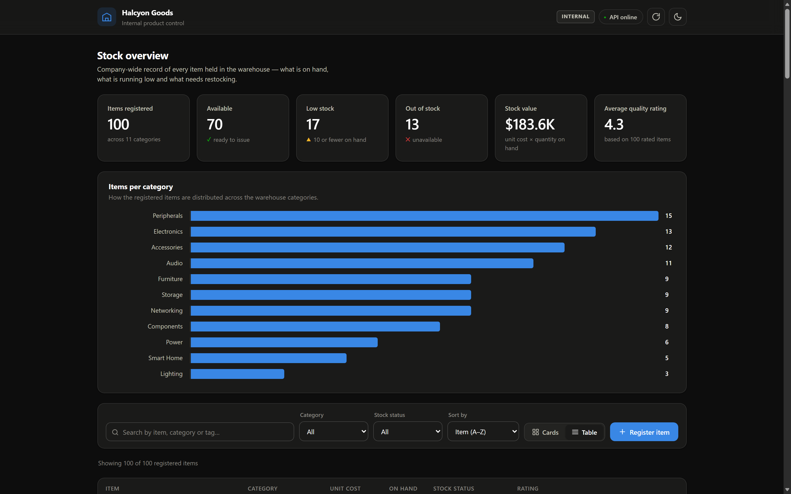

# Halcyon Goods — Internal Product Control

[](https://github.com/gabrantoniette/halcyon-goods-product-control/actions/workflows/ci.yml)

Internal back-office system for controlling a company's products and stock —
**not a storefront**. There is no cart, no checkout and no customer-facing page.
**Halcyon Goods** is a fictional company; this is the tool its staff would use to
see what is registered, how much is on hand, what is running low and what needs
restocking.

Built end to end as a study of how a REST API and the clients that consume it fit
together: one HTTP layer, two interfaces — a web dashboard and a terminal menu.



## Architecture

```
Browser  ──►  client backend  ──►  records API  ──►  SQLite
              (port 80)            (port 8000)       (database.db)

Terminal ──►  client backend  ──►  records API
```

The API and the client are separate applications that only ever speak HTTP — the
client never imports the API's modules. Inside the client, the browser talks to
the client's own backend, which relays the calls to the API. That keeps the
browser on a single origin (so no CORS configuration is required) and means the
HTTP logic and the status messages live in one place, shared by the web UI and
the terminal menu.

**Stack:** Python · FastAPI · SQLModel/SQLAlchemy · SQLite · Pydantic · Uvicorn ·
vanilla JS and CSS (no framework, no build step).

## Project structure

```
├── main.py                  entry point: runs the whole project
├── api/                     the server: owns the data
│   ├── main.py              FastAPI app
│   ├── router.py            product endpoints
│   ├── model.py             table and schemas per verb
│   └── data.py              SQLite engine, session and seeding template
├── client/
│   ├── frontend/            runs in the browser
│   │   ├── index.html
│   │   ├── style.css
│   │   └── app.js
│   └── backend/             runs in python
│       ├── server.py        serves the frontend, relays to the API
│       ├── api_client.py    HTTP calls to the API
│       ├── http_status.py   response handling and status messages
│       └── menu.py          terminal interface
├── tests/                   pytest suite, runs against SQLite in memory
│   ├── conftest.py          fixtures: in-memory database, API client
│   ├── test_products_api.py endpoint behaviour and the uniqueness rules
│   ├── test_pagination.py   paging headers, clamping and ordering
│   ├── test_api_client.py   the page walk in list_products
│   ├── test_http_status.py  the response envelope
│   └── test_web_client.py   the relay between browser and API
├── .github/workflows/ci.yml lint and tests on every push and pull request
├── database.db              created on first run, git-ignored
├── .env.example             API_BASE_URL
├── pyproject.toml           ruff and pytest configuration
├── requirements.txt         what the project needs to run
└── requirements-dev.txt     what it needs to be tested and linted
```

## Setup

```bash
python -m venv venv
venv\Scripts\activate          # Windows
# source venv/bin/activate     # macOS / Linux
pip install -r requirements.txt
```

## Running

A single file starts everything — the API, the web server and the browser:

```bash
python main.py           # web interface
python main.py --cli     # terminal menu instead
```

It can be run from any working directory; all paths resolve relative to the file
itself. Useful flags: `--no-api` expects an API that is already running, and
`--port` changes the web port.

The web interface is served at **http://halcyongoods.test**. That name requires
one line in the system hosts file (`C:\Windows\System32\drivers\etc\hosts` on
Windows, `/etc/hosts` elsewhere), edited as administrator:

```
127.0.0.1   halcyongoods.test
```

Without it nothing breaks — the client falls back to `http://127.0.0.1` and
prints the line you need. The `.test` suffix is reserved by RFC 6761 for local
development, so it can never collide with a real domain.

The register starts empty. `products_db` in `api/data.py` is a commented template
for loading a batch of items in one go.

## API

Base URL: `http://127.0.0.1:8000`. Interactive docs at `/docs`.

| Method | Path | Purpose |
|---|---|---|
| `GET` | `/products?page=1&page_size=10` | one page of registered items |
| `GET` | `/products/{name}` | find an item by exact name |
| `POST` | `/products/{name}` | register an item (name must match the body) → `201` |
| `PUT` | `/products/{name}` | replace an item; all fields required |
| `PATCH` | `/products/{name}` | update only the fields that are sent |
| `DELETE` | `/products/{name}` | remove an item |

Items are addressed by name, so names are kept unique: registering or renaming
into an existing name answers `409 Conflict`. A `POST` whose body name disagrees
with the path answers `422`, rather than letting one silently win.

### Paging

`GET /products` answers one page and reports the counters as headers:

| Header | Meaning |
|---|---|
| `X-Page` | the page actually served (an over-large `page` is clamped) |
| `X-Page-Size` | items per page (default 10, max 200) |
| `X-Total-Pages` | pages available |
| `X-Total-Items` | items registered |

The clients do not page: `api_client.list_products()` walks every page and returns
the full set in one envelope, because the dashboard's totals, chart and filters
are all computed over the whole register. Rows come back ordered by id, so an item
can never land on two pages or on none.

Every client call returns the same envelope, which is what drives the toasts in
the web UI and the messages in the terminal:

```python
{"success": bool, "status_code": int | None, "message": str, "detail": str | None, "data": ...}
```

## Web interface

A back-office dashboard, so the **table is the default view** and the card grid is
the alternative — the opposite of a storefront.

Summary tiles (items registered, available, low stock, out of stock, stock value,
average quality rating), an items-per-category chart, search, category and
stock-status filters, sorting, and a card/table toggle. Items can be registered
(`POST`), replaced (`PUT`), partially updated (`PATCH` — only changed fields are
sent) and removed. Light and dark themes are both supported.

| | |
|---|---|
|  |  |
|  |  |

### Stock status

Three states, derived in one place (`stockState` in `app.js`) so the tiles, the
filter and the badges can never disagree:

| State | Rule |
|---|---|
| Out of stock | `in_stock` is false **or** nothing on hand |
| Low stock | `1 – 10` on hand — flagged for restocking |
| Available | more than 10 on hand |

The threshold is a warehouse rule, not an API field: it lives in
`LOW_STOCK_THRESHOLD` and is derived from `stock`.

Status is shown with an icon and a word alongside the colour, never colour alone:
green and red are the pair colour-blind readers are least able to separate. The
amber used for low stock is darkened for text, where the fill colour would not
clear 4.5:1 on a light surface.

## Tests

```bash
pip install -r requirements-dev.txt
pytest
ruff check .
```

73 tests, no network and no files touched: every one runs against a SQLite
database held in memory, so `database.db` is never opened and each test starts
from an empty register. The suite covers the four layers separately —

| File | What it pins down |
|---|---|
| `test_products_api.py` | the endpoints, and the rules that keep names unambiguous: `409` on a duplicate, `422` when path and body disagree, `404` everywhere else |
| `test_pagination.py` | the `X-Total-*` counters, clamping of an over-large page, and that walking every page yields each item exactly once |
| `test_api_client.py` | the page walk, including that a failed page aborts it rather than reporting half the register as all of it |
| `test_http_status.py` | the response envelope, including an unreachable API and a body that is not JSON |
| `test_web_client.py` | the relay: the API's status code survives the hop, and an unreachable API becomes `503` |

CI runs the same two commands on every push and pull request, across Python
3.11, 3.12 and 3.13. Linting is `ruff check` only — `ruff format` is not
enforced, because the source is hand-formatted in a few places where the
formatter would be harder to read.

## Contributing

`main` is protected and does not take direct pushes. Work happens on a branch and
lands through a pull request, which is what gives a diff to read before it becomes
history.

```bash
git switch -c a-descriptive-name
git push -u origin a-descriptive-name
gh pr create --fill
```

Nothing secret is ever committed. Configuration lives in `.env`, which is listed
in `.gitignore`; `.env.example` documents the expected keys with placeholder
values only.

## Notes and limitations

- Records live in a SQLite file (`database.db`) created next to `main.py` on first
  run, so they survive a restart. The path is anchored to the source file, not the
  working directory, so launching uvicorn from elsewhere cannot quietly create a
  second, empty database.
- There are no migrations — changing the table means deleting `database.db`.
- The API has no authentication and no audit trail of who changed what. For an
  internal tool with more than one user, both are the next step — this is a local
  case study, not a deployment.
- Screenshots in `docs/screenshots/` were captured from the running app against a
  100-item register.

## License

[MIT](LICENSE) © Gabriel Antoniette
