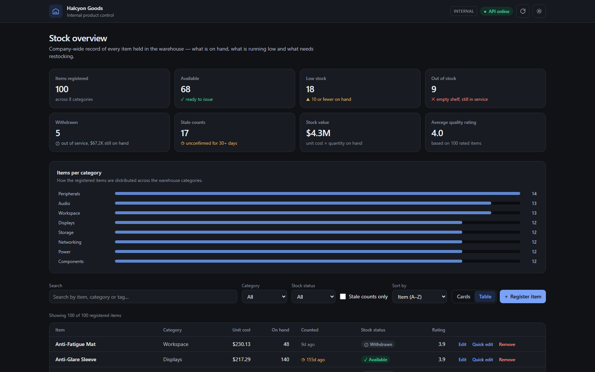

# Halcyon Goods — Internal Product Control

[](https://github.com/gabrantoniette/halcyon-goods-product-control/actions/workflows/ci.yml)

<picture>
  <source media="(prefers-color-scheme: dark)" srcset="https://raw.githubusercontent.com/gabrantoniette/gabrantoniette/main/assets/generated/languages/halcyon-goods-product-control-dark.svg">
  
</picture>

Internal back-office system for controlling a company's products and stock —
**not a storefront**. There is no cart, no checkout and no customer-facing page.
**Halcyon Goods** is a fictional company; this is the tool its staff would use to
see what is registered, how much is on hand, what is running low and what needs
restocking.

Built end to end as a study of how a REST API and the clients that consume it fit
together: one HTTP contract, two interfaces — a web dashboard and a terminal menu.



The rest of the system — registering, updating and removing an item, the
quantities nobody has confirmed lately, the same three operations seen from
Postgres, and the stack booting from an empty volume — is in
[docs/screenshots](docs/screenshots), with each capture explained in
[DESCRIPTIONS.txt](docs/screenshots/DESCRIPTIONS.txt).

**New to the project?** [docs/guide](docs/guide) walks through it from the
beginning — what it does, how the pieces fit, every step from starting it to
shutting it down, and a glossary of every term used. Three diagrams come with
it, including [the full architecture](docs/guide/diagrams/01-architecture.png)
and [the lifecycle from one command to nothing](docs/guide/diagrams/02-lifecycle.png).

## Architecture

```
Browser  ──►  Next.js server  ──►  records API  ──►  Postgres
              (:3000)              (:8000)          (:5432)

Terminal ──────────────────────►  records API
```

Three deployables that only ever speak HTTP. The browser never calls the API
directly: pages are rendered on the Next server, which reads the register in a
Server Component and performs changes through Server Actions.

That boundary is doing real work — it is why **the API key never reaches the
browser**, and why no CORS configuration is needed. `lib/api.ts` imports
`server-only`, so importing it from a Client Component is a build error rather
than a leak discovered later.

**Stack:** Python · FastAPI · SQLModel/SQLAlchemy · Alembic · Postgres ·
Pydantic · Uvicorn · TypeScript · Next.js 16 (App Router) · React 19 ·
Tailwind v4 · Zod · Docker Compose.

## Project structure

```
├── apps/
│   ├── api/                     the server: owns the data
│   │   ├── src/halcyon_api/
│   │   │   ├── main.py          app factory, error handlers
│   │   │   ├── config.py        settings from the environment
│   │   │   ├── db.py            engine and session
│   │   │   ├── models.py        the stored table
│   │   │   ├── schemas.py       request/response shapes per verb
│   │   │   ├── security.py      the API key check
│   │   │   ├── routers/         HTTP translation only
│   │   │   └── services/        the rules, and the domain errors
│   │   ├── migrations/          Alembic
│   │   ├── tests/               77 tests
│   │   ├── seed.py              an example catalogue, 100 products
│   │   └── Dockerfile
│   │
│   ├── web/                     the dashboard
│   │   ├── app/
│   │   │   ├── page.tsx         reads the register on the server
│   │   │   └── actions.ts       Server Actions: create/replace/patch/delete
│   │   ├── components/          tiles, chart, table, cards, dialogs, toasts
│   │   ├── lib/
│   │   │   ├── api.ts           server-only client; holds the key
│   │   │   ├── schemas.ts       Zod, mirroring the Pydantic models
│   │   │   └── stock.ts         the four stock states and the count-age rule
│   │   └── Dockerfile
│   │
│   └── cli/                     the terminal client
│       ├── src/halcyon_cli/
│       │   ├── api_client.py    HTTP calls
│       │   ├── http_status.py   the response envelope
│       │   └── menu.py          the menu
│       └── tests/               31 tests
│
├── docker-compose.yml           Postgres + API + web
├── .github/workflows/ci.yml     lint, tests, migrations, build
└── ruff.toml
```

## Running

### With Docker

```bash
cp .env.example .env
docker compose up --build
```

Dashboard on **http://localhost:3000**, API docs on **http://localhost:8000/docs**.

The API runs `alembic upgrade head` before it starts serving, so a fresh volume
and an upgraded one both converge before the first request. Compose waits on
Postgres's healthcheck before starting the API, and on the API's before the web.

### Without Docker

Three terminals; the API falls back to SQLite when no Postgres URL is set.

```bash
# 1. the API
cd apps/api && pip install -e ".[dev]" && alembic upgrade head
uvicorn halcyon_api.main:app --reload

# 2. the dashboard
cd apps/web && npm install && npm run dev

# 3. the terminal client (optional)
cd apps/cli && pip install -e "." && halcyon
```

## Configuration

Everything is read from the environment; every value has a working default, so a
clone runs with no `.env` at all. See [.env.example](.env.example).

| Variable | Default | Purpose |
|---|---|---|
| `HALCYON_DATABASE_URL` | `sqlite:///./database.db` | SQLite locally, Postgres in compose |
| `HALCYON_API_KEY` | *(empty)* | set it and every write needs `X-API-Key` |
| `HALCYON_API_BASE_URL` | `http://127.0.0.1:8000` | where the clients look for the API |
| `HALCYON_CORS_ORIGINS` | `http://localhost:3000` | only for a browser calling the API directly |
| `HALCYON_ENVIRONMENT` | `development` | echoed by `/health` |

## API

| Method | Path | Auth | Purpose |
|---|---|---|---|
| `GET` | `/health` | — | liveness, used by the container healthcheck |
| `GET` | `/products?page=1&page_size=10` | — | one page of registered items |
| `GET` | `/products/{name}` | — | find an item by exact name |
| `POST` | `/products/{name}` | key | register an item → `201` |
| `PUT` | `/products/{name}` | key | replace an item; all fields required |
| `PATCH` | `/products/{name}` | key | update only the fields that are sent |
| `DELETE` | `/products/{name}` | key | remove an item |

Reads are open so a dashboard can be pointed at the API without a secret; writes
need the key. With no key configured the check is off, which keeps a bare
`uvicorn` and the test suite frictionless — compose sets one, so the
containerised stack is closed by default. The key is compared with
`secrets.compare_digest`, not `==`, so a wrong key cannot be discovered one
character at a time by timing the response.

Items are addressed by name, so names are kept unique: registering or renaming
into an existing name answers `409`. A `POST` whose body name disagrees with the
path answers `422`, rather than letting one silently win.

### Paging

`GET /products` answers one page and reports the counters as headers —
`X-Page` (the page actually served; an over-large one is clamped), `X-Page-Size`,
`X-Total-Pages`, `X-Total-Items`.

Both clients walk every page and work on the full set, because the dashboard's
totals, chart and filters are computed over the whole register. Rows come back
ordered by id, so an item can never land on two pages or on none. A page that
fails aborts the walk: half the register reported as all of it would make every
total wrong.

## Database

Schema changes go through Alembic. Nothing in the app creates tables — an app
that silently created what a migration should have made would let production
drift away from the migration history without anyone noticing.

```bash
cd apps/api
alembic revision --autogenerate -m "what changed"
alembic upgrade head
alembic check            # fails if the models and the migrations disagree
```

`env.py` reads the URL from the same settings the app uses, so a migration can
never be applied to a different database than the one the API talks to.
Revisions run in batch mode on SQLite, which cannot `ALTER` most things in
place, so one revision applies to both backends.

### Example data

An empty register makes the dashboard hard to judge, so `seed.py` loads a
catalogue of 100 products across eight categories.

```bash
cd apps/api
python seed.py                              # local, whichever URL is configured
python seed.py --reset                      # empty the register first

docker compose exec api python seed.py      # the compose database
```

It follows `HALCYON_DATABASE_URL` like everything else, and prints where it is
writing with the password masked. Products are matched by name, the unique
column, so a second run inserts nothing — which also makes it a way to find out
what has been deleted, since the count it reports as added is exactly that.

Prices, stock, ratings and dates are generated from a fixed seed rather than
typed out, so two runs produce the same register. The stock states are dealt
from a fixed pool instead of rolled per product, so the counts are exact and
every dashboard filter and badge has something to show. Nothing here creates a
table: `alembic upgrade head` has to have run first, and the script stops with
that instruction if it has not.

## Tests

```bash
cd apps/api && pytest      # 77
cd apps/cli && pytest      # 31
ruff check .
cd apps/web && npm run typecheck && npm run lint && npm run build
```

108 Python tests, none of which touch the network or a real database: every one
runs against SQLite held in memory, so each starts from an empty register.

| File | What it pins down |
|---|---|
| `api/tests/test_products_api.py` | the endpoints, the rules that keep names unambiguous, and what may and may not move `stock_counted_at` |
| `api/tests/test_pagination.py` | the counters, clamping, and that walking every page yields each item exactly once |
| `api/tests/test_auth.py` | writes closed, reads open, and that the key is never echoed back |
| `api/tests/test_health.py` | that the unauthenticated endpoint leaks neither the database URL nor the key |
| `api/tests/test_migrations.py` | `upgrade head`, then a diff against the models — the rest of the suite builds tables from metadata, which is fast but would pass while the migrations rotted |
| `api/tests/test_config.py` | the settings read from real environment variables, including the comma-separated list form a `.env` or compose file uses |
| `cli/tests/test_api_client.py` | the page walk, including that a failed page aborts it |
| `cli/tests/test_http_status.py` | the response envelope |
| `cli/tests/test_write_headers.py` | the key on writes, and never on reads |

CI runs all of it on every push and pull request: Python 3.11/3.12/3.13, the
migrations against a real Postgres service, and the web app's types, lint and
production build.

## Web interface

A back-office dashboard, so the **table is the default view** and the card grid
is the alternative — the opposite of a storefront.

Summary tiles (items registered, available, low stock, out of stock, withdrawn,
stale counts, stock value, average quality rating), an items-per-category chart,
search, category and stock-status filters, a stale-count filter, sorting, and a
card/table toggle. Items can be registered (`POST`), replaced (`PUT`), partially
updated (`PATCH` — only changed fields are sent) and removed. Light and dark
themes are both supported, applied before first paint so a reader who chose dark
never sees a white flash.

### Stock status

Four states, derived in one place (`stockState` in `lib/stock.ts`) so the tiles,
the filter and the badges can never disagree:

| State | Rule | Reading |
|---|---|---|
| Available | in service, more than 10 on hand | fine |
| Low stock | in service, `1 – 10` on hand | flagged for restocking |
| Out of stock | in service, nothing on hand | a supply problem — reorder |
| Withdrawn | `in_stock` is false, any quantity | a decision — do not issue, do not buy |

The last two are kept apart on purpose. They are not the same event and they do
not route to the same person: an empty shelf belongs to purchasing, while a
withdrawn line has already been decided and is not a signal to buy anything — a
withdrawn line can hold 40 units that exist and must not be issued. Collapsing
them into one badge, which is what `!in_stock || stock === 0` did, left the
screen unable to say which one it was looking at.

The threshold is a warehouse rule, not an API field. Status is shown with an
icon and a word alongside the colour, never colour alone: green and red are the
pair colour-blind readers are least able to separate. The amber used for low
stock is darkened for text, where the fill colour would not clear 4.5:1 on a
light surface. Withdrawn is the only muted badge — a settled decision rather
than an open problem, so putting it in an alarm colour would cost the other
three their urgency.

### How old the quantity is

A separate question from what the quantity says, so it is a separate field, a
separate column in the table and a separate filter in the toolbar.

`stock_counted_at` records when the quantity was last established. `updated_at`
cannot stand in for it: that moves whenever the row is written at all, so a
corrected price would report a six-week-old count as fresh. Only a change to
`stock` moves it — a write that restates the same quantity establishes nothing
and deliberately does not count. It is nullable, and `null` means nobody has
ever counted it, which is why the migration that added the column left existing
rows null rather than inventing a date. Anything over 30 days, `null` included,
is shown as stale.

The category chart uses one hue for every bar — the categories are nominal, so
shading them by size would double-encode the bar length as colour. Each bar is
directly labelled, which is why there are no gridlines, and the table below is
its accessible twin.

## Contributing

`main` is protected and does not take direct pushes. Work happens on a branch
and lands through a pull request, which is what gives a diff to read before it
becomes history.

```bash
git switch -c a-descriptive-name
git push -u origin a-descriptive-name
gh pr create --fill
```

Nothing secret is ever committed. Configuration lives in `.env`, which is listed
in `.gitignore`; `.env.example` documents the expected keys with placeholder
values only.

## Notes and limitations

- There is no audit trail of who changed what. For an internal tool with more
  than one user that is the next step, along with per-user accounts instead of
  one shared key.
- The API key is a single shared secret. It is the right weight for an internal
  service behind a network boundary, not for anything public.
- The dashboard reads the whole register to compute its totals. That is honest
  at this size and would need server-side aggregates well before it stopped
  being.
- The Postgres volume is mounted at `/var/lib/postgresql`, not at
  `/var/lib/postgresql/data`. Postgres 18 stores data in a major-version
  subdirectory so `pg_upgrade --link` works across the mount boundary, and it
  refuses to start against the old path.

## License

[MIT](LICENSE) © Gabriel Antoniette
