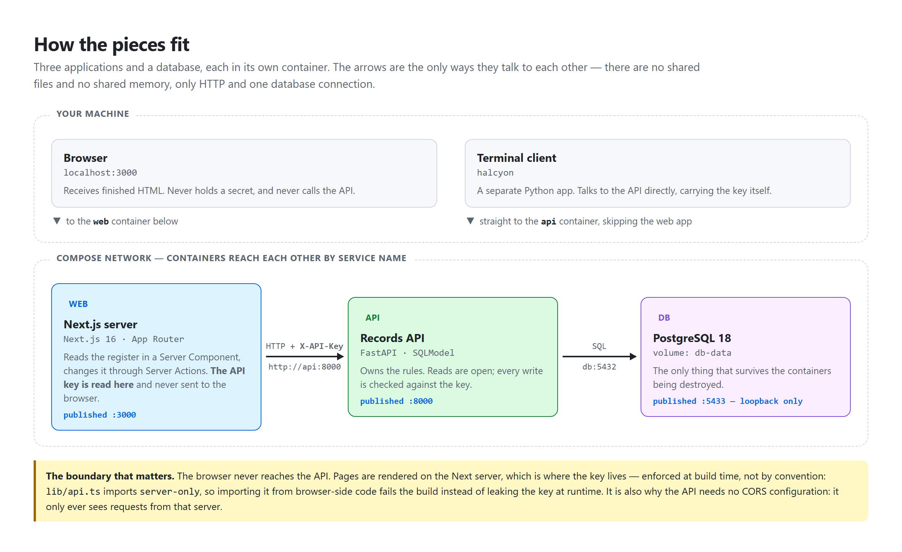

# 2 — Architecture

[← back to the guide](README.md)

---



## Four parts, and the only paths between them

There are no shared files and no shared memory anywhere in this system. Every
connection in the diagram is either an HTTP call or a database connection, and
nothing communicates any other way.

That sounds restrictive and is the point: it means each part can be replaced,
restarted or moved to another machine without the others noticing.

```
Browser  ──►  Next.js server  ──►  records API  ──►  Postgres
              (holds the key)      (checks it)

Terminal ─────────────────────►  records API
```

---

## The boundary that carries the most weight

**The browser never talks to the API.**

When you open the dashboard, the page is built on the Next.js server. That
server reads the register from the API, renders finished HTML, and sends it
down. When you submit a form, the browser calls a **Server Action** — a function
that runs back on the server — which is what actually calls the API.

The API key is read on that server and has no path to the browser.

This is enforced rather than intended. The one file that talks to the API
imports a package called `server-only`, which makes importing that file from
browser-side code **a build error**. The mistake cannot reach production,
because the build fails first.

It also removes a whole category of configuration. The API only ever receives
requests from that one server, never from a page, so there is no CORS setup
anywhere in the project.

### Why not just call the API from the browser?

It would be one layer fewer, and it would mean one of two things:

- shipping the API key to every visitor — anyone could read it in the developer
  tools and write to the register directly; or
- building sessions, login and token refresh to avoid that.

Rendering on the server sidesteps both. The secret stays where secrets belong.

---

## Inside the API: three layers, one job each

```
routers/    speak HTTP, and nothing else
services/   own the rules, and know nothing about HTTP
models.py   describe the stored table
```

A router reads the request and hands the values to a service. The service
applies the rules and, when something is wrong, raises a **domain error** — an
exception with a name like `DuplicateProductName`, which says what happened in
the language of the problem rather than in the language of HTTP.

One place, at the top of the application, maps those errors onto status codes:

| Domain error | Becomes |
|---|---|
| `ProductNotFound` | `404` |
| `DuplicateProductName` | `409` |
| `NameMismatch` | `422` |

The mapping exists in exactly one place so that a given failure cannot end up
spelled three different ways across seven endpoints — which is what happens when
each handler decides for itself.

The payoff of keeping the rules ignorant of HTTP is that they are testable
without a web server, and reusable by anything that is not a web request.

---

## How the containers find each other

Each service in `docker-compose.yml` gets a name, and inside the private network
Docker creates, **that name works as a hostname**:

- The dashboard reaches the API at `http://api:8000`.
- The API reaches the database at `db:5432`.

Neither address exists outside that network. They are not IP addresses that
someone configured; they are the service names from the compose file.

Separately, three ports are **published** to the host machine so that you can
reach them from your own browser and tools:

| | Published as | For |
|---|---|---|
| dashboard | `localhost:3000` | you, in a browser |
| API | `localhost:8000` | the interactive docs, and testing by hand |
| database | `localhost:5433` | pgAdmin or `psql`, if you want to look at the data |

The database port is bound to the **loopback address only**, so it is reachable
from your machine and from nowhere else. Without that restriction Docker
publishes on every network interface, which would put a database carrying
default credentials in front of anyone sharing your network.

It is published on `5433` rather than the usual `5432` because most machines
with Postgres installed are already using `5432` for a *different* database, and
the two must not collide.

---

## Where the data lives

The database writes to a Docker **volume** — a piece of storage that exists
independently of any container.

This matters more than it sounds. A container's own filesystem is discarded when
the container is removed, so a database writing there would lose everything on
every restart. The volume is what makes the data survive.

The practical consequence is a distinction worth remembering:

| Command | Containers | Data |
|---|---|---|
| `docker compose down` | removed | **kept** |
| `docker compose down -v` | removed | **destroyed** |

---

## The security model, in full

It is small, and being small is a feature.

- **Reads are open.** Anyone who can reach the API can list products.
- **Writes need a key**, sent as an `X-API-Key` header.
- **If no key is configured, the check is off entirely.** That is what keeps the
  test suite and local development frictionless. The compose stack always sets
  one, so the containerised system is closed by default.
- **The key is compared with `secrets.compare_digest`, not `==`.** A normal
  string comparison stops at the first differing character, so it returns very
  slightly faster for a key that shares a prefix with the real one. Measured
  over enough requests, that difference leaks the key one character at a time.
  The constant-time comparison removes the signal.
- **Both containers run as a non-root user**, so a container escape does not
  begin with administrative privileges on the host.

What is deliberately **not** here: user accounts, roles, per-user permissions,
and an audit trail. This is an internal tool with a single shared key. Anything
more would be pretending to solve a problem the project does not have.

---

**Next:** [03-running-it.md](03-running-it.md) — how to actually start it.
