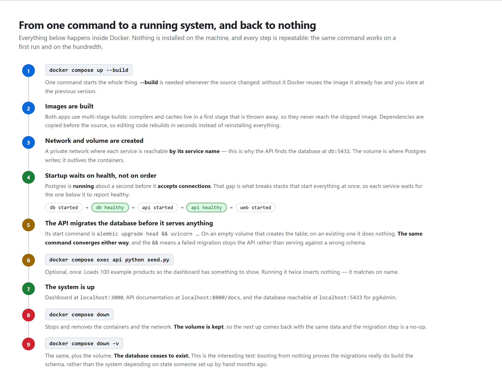

# 3 — Running it, from start to shutdown

[← back to the guide](README.md)

---



## Before you start

You need **Docker Desktop** installed and running. Nothing else — not Python,
not Node.js, not PostgreSQL. Everything the system needs travels inside the
images.

Open a terminal in the repository folder.

---

## Step 1 — Configuration

```bash
cp .env.example .env
```

`.env.example` is committed and contains placeholder values; `.env` is yours and
is deliberately never committed, because it holds the API key and the database
password.

Every value has a working default, so the copy is enough to get started. For
anything beyond your own machine, change `POSTGRES_PASSWORD` and set a real
`HALCYON_API_KEY`:

```bash
python -c "import secrets; print(secrets.token_urlsafe(32))"
```

> **A distinction that catches people out.** This `.env` at the repository root
> is read by *Docker Compose*, to fill in the compose file. It is not injected
> into the containers wholesale — only the variables listed under
> `environment:` in `docker-compose.yml` reach them. There is a second, separate
> `.env` under `apps/api/`, used when running the API directly without Docker.

---

## Step 2 — Start everything

```bash
docker compose up --build
```

Add `-d` to run it in the background and get your terminal back:

```bash
docker compose up -d --build
```

**`--build` matters.** Without it, Docker reuses the images it already has. If
you changed the source and left it out, you will be looking at the previous
version and wondering why your edit did nothing.

### What happens, in order

**1. The images are built.** Roughly two minutes the first time — it downloads
Python, Node.js and Postgres, and runs `npm ci` and a production build of the
dashboard. Afterwards it is seconds, because Docker caches each step and only
redoes the ones whose inputs changed.

**2. A private network and a storage volume are created.** The network is what
makes `db` and `api` work as hostnames between containers.

**3. The database starts** — and then compose *waits*. Every five seconds it
runs `pg_isready` inside the container until Postgres answers.

This wait is the part worth understanding. **Postgres reports as "running"
about a second before it can accept a connection.** Starting everything
simultaneously means the API tries to connect during that gap and crashes. It
usually works on a fast machine and fails on a slow one, which is the worst
possible failure mode. So each service waits for the one below it to report
*healthy*, not merely *started*:

```
db started → db healthy → api started → api healthy → web started
```

**4. The API migrates the database, then serves.** Its start command is:

```
alembic upgrade head && uvicorn halcyon_api.main:app …
```

On an empty volume, that creates the table. On a volume that already has it, it
does nothing at all. **The same command is correct in both cases** — you never
have to know which state the database is in before starting.

The `&&` is doing real work: if the migration fails, the API does not start.
A container that refuses to boot is far better than one serving requests against
a schema it does not match.

**5. The dashboard starts** once the API reports healthy.

### Checking it worked

```bash
docker compose ps
```

All three should say `healthy`.

---

## Step 3 — Load the example data

The database starts empty, so the dashboard would show nothing. Load a catalogue
of 100 example products:

```bash
docker compose exec api python seed.py
```

`docker compose exec` runs a command **inside a running container**. It prints
where it is writing, with the password masked, then reports what it did:

```
Register: postgresql+psycopg://halcyon:***@db:5432/halcyon
Added 100 product(s), skipped 0 already registered.
The register now holds 100 product(s) across 8 categories.
```

Run it a second time and it adds nothing — it matches on name, which is unique.
That is also a diagnostic: if it ever reports adding three products, three of
the originals had been deleted.

---

## Step 4 — Use it

| | |
|---|---|
| **Dashboard** | http://localhost:3000 |
| **API documentation** | http://localhost:8000/docs |
| **Database** | `localhost:5433` — user `halcyon`, database `halcyon` |

The API documentation page is generated by FastAPI from the code itself, so it
can never drift out of date. You can send real requests from it.

In the dashboard you can search, filter by category and stock status, narrow to
quantities nobody has confirmed lately, sort, switch between table and card
views, toggle the theme, and register, edit and remove items.

The stock-status filter and the stale-count checkbox are separate controls
because they answer separate questions — what the quantity says, and how old it
is. See [the database](04-the-database.md#two-fields-four-states).

Two editing modes exist, and the difference is real:

- **Edit** sends a `PUT` — the whole item is replaced, every field required.
- **Quick edit** sends a `PATCH` — only the fields you actually changed are
  sent. If you change nothing, no request is made at all, which keeps
  `updated_at` meaning "last genuinely modified" rather than "last time someone
  opened the form".

---

## Step 5 — Watching what happens

```bash
docker compose logs -f api        # follow the API's log
docker compose logs -f            # all three at once
docker compose exec api sh        # a shell inside the API container
```

The API logs every request with its status code, so creating something in the
dashboard produces a visible line:

```
"POST /products/Thermal%20Label%20Printer HTTP/1.1" 201 Created
```

---

## Step 6 — Shutting down

```bash
docker compose down
```

Stops and removes the containers and the network. **The volume is kept**, so the
data is still there and the next `docker compose up -d` returns everything as it
was — including the 100 seeded products. The migration step will find the schema
already current and do nothing.

### Destroying the data too

```bash
docker compose down -v
```

The `-v` also removes the volume. **The database ceases to exist.**

Use it when you want a genuinely clean start — and it is worth doing
occasionally on purpose. Booting from nothing is the test that proves the
migrations really do build the schema, rather than the system quietly depending
on something that was set up by hand months ago and never written down.

The full cycle:

```bash
docker compose down -v
docker compose up -d --build
docker compose exec api python seed.py
```

---

## Command reference

```bash
docker compose up -d --build        # build and start, in the background
docker compose ps                   # what is running, and its health
docker compose logs -f api          # follow one service's log
docker compose exec api sh          # a shell inside a container
docker compose restart api          # restart one service
docker compose down                 # stop; keep the data
docker compose down -v              # stop; destroy the data
```

---

## Running it without Docker

Useful while developing, because the API reloads on every file save. Three
terminals:

```bash
# 1 — the API (falls back to a local SQLite file if no Postgres URL is set)
cd apps/api && pip install -e ".[dev]" && alembic upgrade head
uvicorn halcyon_api.main:app --reload

# 2 — the dashboard
cd apps/web && npm install && npm run dev

# 3 — the terminal client (optional)
cd apps/cli && pip install -e "." && halcyon
```

> **This uses a different database.** Run this way, the API reads
> `apps/api/.env` and talks to whatever is configured there — a local SQLite
> file by default, or a Postgres installed on your machine. The compose stack
> has its own Postgres in a container, with its own storage. **The two never see
> each other's data.** Anything created in one is invisible in the other, and
> this is the single most common source of confusion when both are set up.

---

## When something goes wrong

| Symptom | Cause | Fix |
|---|---|---|
| A port is already in use | something else holds 3000, 8000 or 5433 | stop it, or change the left-hand number in `docker-compose.yml` |
| Your code change did nothing | the image was not rebuilt | add `--build` |
| The dashboard is empty | the database was never seeded | `docker compose exec api python seed.py` |
| The API keeps restarting | it cannot reach the database, or a migration failed | `docker compose logs api` — the reason is in there |
| A write returns `401` | no API key was sent | that is correct behaviour; reads are open, writes are not |
| A write returns `403` | the key sent is wrong | check `HALCYON_API_KEY` in `.env` |
| The database seems to hang for ~90s | a client using `localhost` against an IPv4-only binding | already fixed — both loopback addresses are published |

---

**Next:** [04-the-database.md](04-the-database.md) — how the data is managed.
