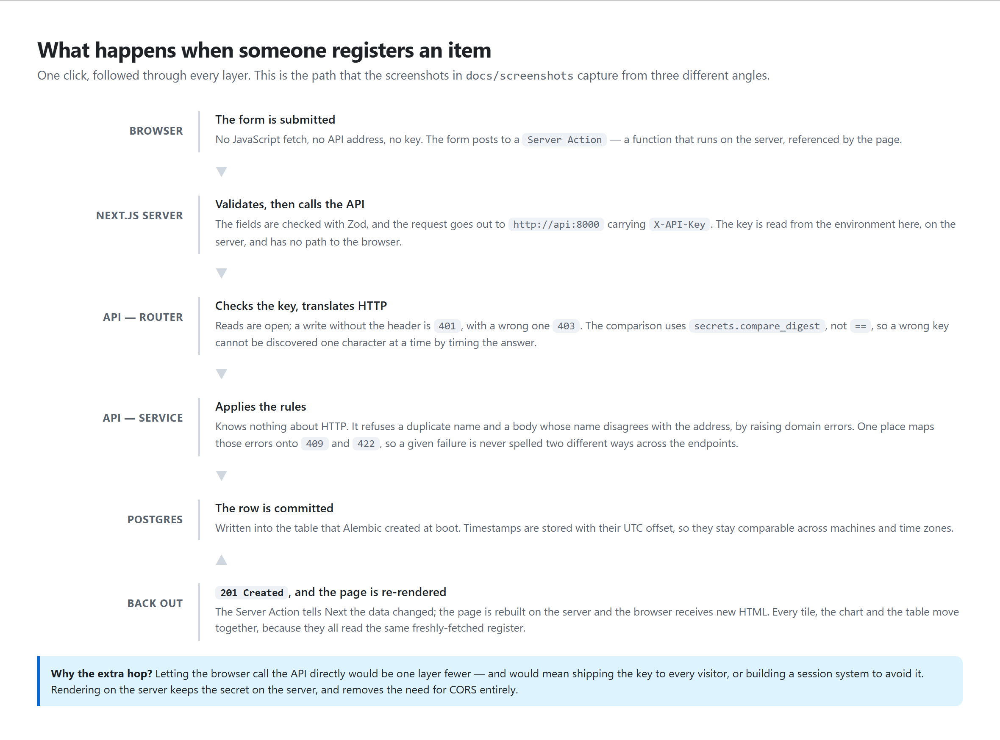

# 4 — The database

[← back to the guide](README.md)

---



## One table

```
product
├── id           the internal primary key, never leaves the API
├── uuid         a public identifier
├── name         unique — this is how items are addressed
├── category
├── price
├── stock        how many are on hand
├── in_stock     whether it can be issued at all
├── rating       0 to 5
├── tags         a list
├── created_at
└── updated_at
```

Two of these are worth explaining.

**`name` is unique**, because items are addressed by name in the URL:
`/products/Mechanical Keyboard 60%`. Registering or renaming into a name that
already exists answers `409` rather than silently overwriting.

**`in_stock` is separate from `stock` being zero.** They mean different things: a
quantity of zero says the shelf is empty, while `in_stock = false` says the line
has been withdrawn from service — which can be true even with 40 units sitting
in the warehouse. A check on `stock == 0` alone would miss that case entirely.

The dashboard derives three states from the pair:

| State | Condition |
|---|---|
| Out of stock | `in_stock` is false, **or** `stock` is 0 |
| Low stock | 10 or fewer on hand |
| Available | everything else |

The threshold of 10 is a warehouse rule, not a database field, so it is defined
once in the dashboard and derived from `stock` everywhere it is needed.

---

## Migrations — the important idea

Code can simply be replaced when you deploy. A database cannot: it holds data
you must not lose. So every schema change has to be a *transformation* of what
is already there.

That is what **Alembic** manages. `apps/api/migrations/versions/` holds an
ordered, immutable list of scripts. Each one has:

- `upgrade()` — how to move forward,
- `downgrade()` — how to undo it, which is your escape hatch when a deploy goes
  wrong.

Each script records which one comes before it, forming a chain. Alembic keeps a
tiny table in the database itself, `alembic_version`, holding the id of the last
script applied — so it always knows exactly how far along a given database is,
and applies only what is missing.

### The rule the project holds to

**Nothing in the application ever creates a table.**

There is a one-line shortcut available in SQLModel that creates any missing
tables at startup. It is not used, and the reason is written in the source: it
creates tables that do not exist but **never alters one that does**. Add a
column to the model and it silently does nothing — the application starts
normally and fails on the first query, in production, with a column that was
never created.

More fundamentally, the shortcut cannot know your intent. If you rename `price`
to `unit_price`, should it rename the column and keep the values, or drop the
old one and create an empty new one? Both produce the same final schema; one
destroys every price. Only a human can answer that, which is why the
transformation has to be written down rather than inferred.

### Working with them

```bash
cd apps/api
alembic revision --autogenerate -m "what changed"   # draft a migration
alembic upgrade head                                # apply everything pending
alembic downgrade -1                                # undo the last one
alembic check                                       # fail if models and migrations disagree
```

**Always read the generated file before committing it.** Autogenerate compares
schemas and does not know intent. It gets three cases wrong predictably: a
rename becomes a drop-plus-add, a new non-nullable column on a table with
existing rows fails outright, and moving data between columns is never generated
at all.

`alembic check` is the safety net for the most common mistake — changing a model
and forgetting to generate the migration. It runs in CI on every push.

### One revision, two databases

Development can run against SQLite, a single file needing no installation.
Production runs Postgres. SQLite cannot `ALTER` most things in place, so Alembic
rewrites the table instead; Postgres alters it directly.

The project handles this by choosing the strategy from configuration rather than
maintaining two sets of migrations, so a single revision applies correctly to
both.

---

## Example data

```bash
docker compose exec api python seed.py       # inside the container
python seed.py                               # or locally, from apps/api
python seed.py --reset                       # empty the register first
```

It loads 100 products across eight categories. Three things about it are
deliberate:

**The numbers are generated from a fixed seed**, not typed out. Two runs produce
an identical register, so a screenshot or a bug report stays reproducible.

**The stock states are dealt from a fixed pool** rather than rolled per product,
so the counts are exact — 70 available, 18 low, 12 out — instead of merely
likely. Every filter and every badge has something to show.

**Dates are spread across the previous 18 months.** This has a useful side
effect: any recent timestamp is real activity rather than seeded data, which
makes "what changed today?" a query anyone can write.

It refuses to run against a database that has not been migrated, and says so:

```
The 'product' table does not exist yet.
Create the schema first, from this directory:

    alembic upgrade head
```

---

## Looking at the data

### With `psql`, inside the container

```bash
docker compose exec db psql -U halcyon -d halcyon
```

Then `\dt` lists tables, `\d product` describes the table, `\q` quits.

For a single query:

```bash
docker compose exec db psql -U halcyon -d halcyon -c "select count(*) from product;"
```

### With pgAdmin or another GUI

Connect to `localhost`, port **5433**, database `halcyon`, user `halcyon`.

> If a Postgres is also installed on your machine, you will have **two servers**
> in the tree: yours on `5432` and the container's on `5433`. They are entirely
> separate databases. Name them clearly — the single most common confusion is
> querying one while looking at the other and concluding the data vanished.
>
> A one-line way to tell which you are connected to: `select version();` returns
> `x86_64-windows` for a Windows install, and `x86_64-pc-linux-musl` for the
> container, which runs Alpine Linux.

### Useful queries

```sql
-- registered recently (seeded rows are all months old)
select name, category, price, created_at from product
where created_at > now() - interval '1 day' order by created_at desc;

-- changed recently
select name, price, stock, updated_at from product
where updated_at > now() - interval '1 day' order by updated_at desc;

-- what is running low
select name, stock from product
where in_stock and stock <= 10 order by stock;
```

---

## What the database does not keep

**There is no history.** The table holds the current state, not the story of how
it got there.

- A deletion leaves no trace. The row is gone.
- An update does not keep the previous value.
- Nothing records *who* made a change — there is one shared key.

Two partial workarounds exist. The container logs show each request with its
verb and time, though they are lost on `docker compose down`. And re-running
`seed.py` reports how many products it re-added, which is exactly how many of
the originals had been deleted.

Real traceability would mean a second table recording every change with its old
and new values. That is a feature to add deliberately, not an oversight to
patch.

---

## Timestamps, and one decision worth the paragraph

Both timestamp columns are declared as *timezone-aware*.

A naive column silently discards the offset. Write `14:30 UTC` and read back
`14:30` with no indication of which zone it belonged to — so a server in
São Paulo and one in Frankfurt disagree about when something happened, and
nothing in the data reveals it. The bug surfaces months later as an ordering
that makes no sense.

Storing the offset makes the values comparable everywhere. The project's
screenshots show this directly: a `PATCH` moves `price`, `stock` and
`updated_at` while leaving `created_at` untouched, and every value comes back
carrying its `+00`.

---

**Next:** [05-glossary.md](05-glossary.md) — every term, in plain language.
